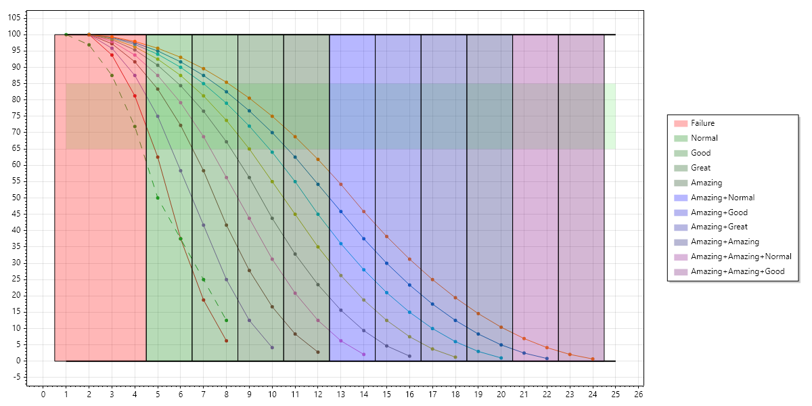

# Skill Dice

##  Skill Levels
|Skill Level|Skill Dice|
|-----------|----------|
| 1 | 2d4 |
| 2 | 1d4, 1d6 |
| 3 | 2d6 |
| 4 | 1d6, 1d8 |
| 5 | 2d8 |
| 6 | 1d8, 1d10 |
| 7 | 2d10 |
| 8 | 1d10, 1d12 |
| 9 | 2d12 |

## Unskilled

|Ability Level|Ability Dice|
|-----------|------------|
| 1 | 2d6 take lowest|
| 2 | 1d6 |
| 3 | 2d6 take highest |