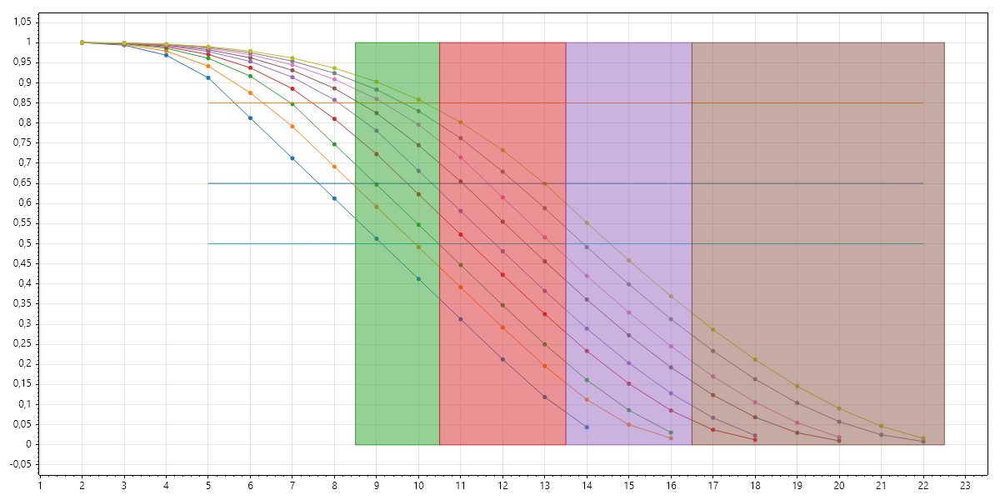

# Core Mechanic

Roll 1d10 and your two skill dice and take the sum of the 1d10 and the highest roll of your two skill dice. Compare the result to the Success Target. If your roll is equal to the target or higher, it's a success.

## Levels of success
Levels of success: 9-10 = Weak, 11-13 = Good, 14-16 = Great, 17+ = Amazing 

# Skill Dice

##  Skill Levels
|Skill Level|Skill Dice|
|-----------|----------|
| 1 | 2d4 |
| 2 | 1d4, 1d6 |
| 3 | 2d6 |
| 4 | 1d6, 1d8 |
| 5 | 2d8 |
| 6 | 1d8, 1d10 |
| 7 | 2d10 |
| 8 | 1d10, 1d12 |
| 9 | 2d12 |

## Unskilled
Roll 1d10 and add the _lowest_ of your two ability dice.  

|Ability Level|Ability Dice|
|-----------|------------|
| 1 | 2d4 |
| 2 | 2d6 |
| 3 | 2d8 |

# Talents
## Body
- Melee
- Archery
- Brawl
- Stealth
- Riding
- Acrobatics
- Athletics
- Dancing

## Hands
- Picking locks
- Picking pockets
- Gambling (cheating)
- Forgery
- Music (playing)
- Drawing
- Crafting
- Calligrahpy
- Medicine
  
## Intellect
- Knowledge 
- Perception
- Investigate
- Research
- Medicine
- Survival

## Social
- Insight
- Influence
  - Persuade
  - Intimidate
  - Deceive
- Performance
  - Acting
  - Music
  

## Magic 

# Character Concepts

## Monster Hunter
Body - Melee or Archery
Mind - Knowledge(Monster Lore)
## Thief-catcher
## Bounty Hunter

## Dungeon Delver

## Swordsman
Body - Melee (Swords) 
Intellect - Knowledge (Tactics)

## Knight
Body - Melee (Sword, Mace), Mounted combat (Lance)
Social - Chivalry, Etiquette

## Archer
Body - Archery (Bows)

## Brawler
Body - Brawling

## Thief
Hands - Lockpicking, Pickpocket

